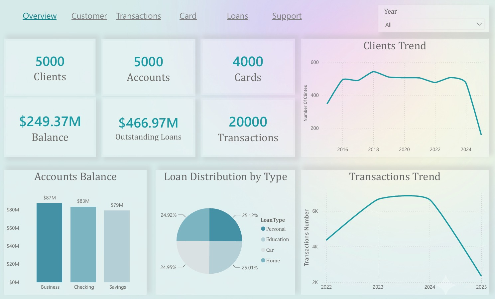
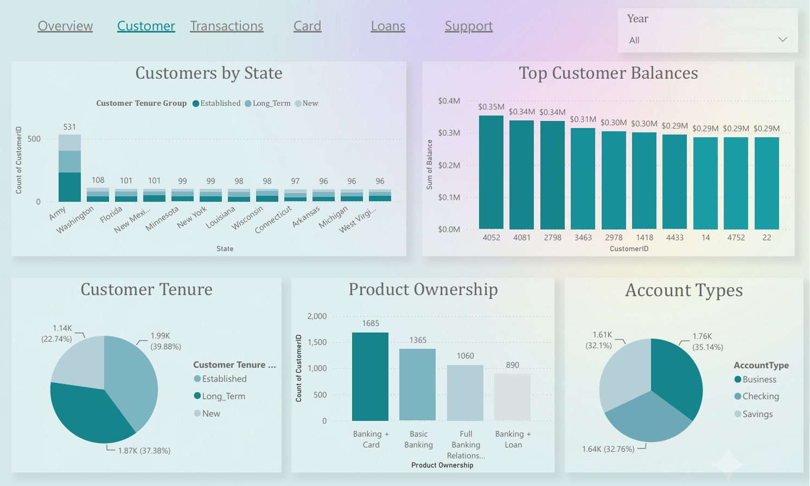
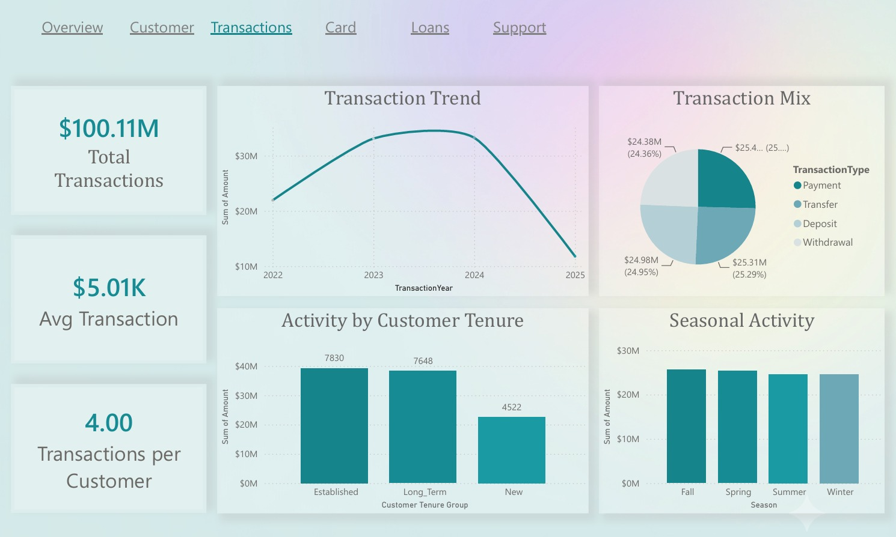
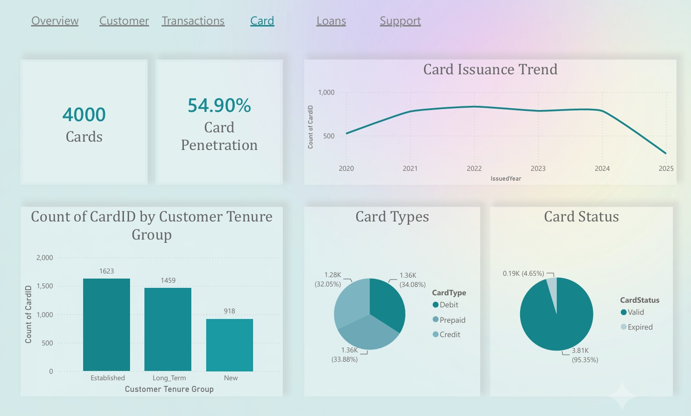
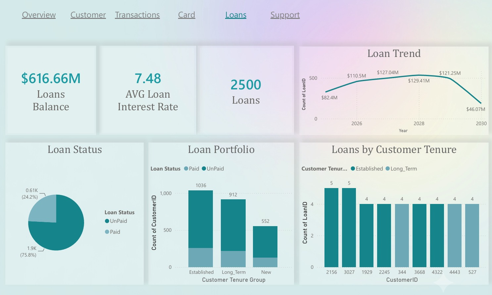
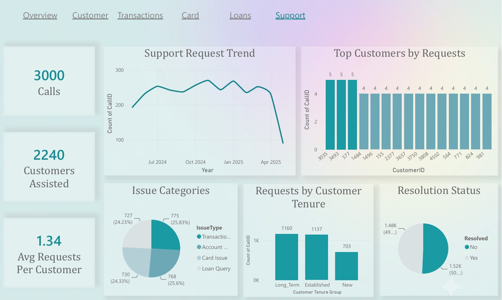

# Banking Analytics Dashboard

## Project Overview

This project presents an end-to-end Banking Analytics Dashboard developed using Power BI to transform raw banking data into meaningful business insights.

The dashboard integrates multiple banking datasets into a unified analytical model, enabling decision-makers to monitor customer relationships, banking products, financial activity, lending performance, and customer support through interactive business reports.

---

## Business Objective

The dashboard was designed to answer key business questions such as:

- How is the bank's customer base evolving?
- How are customers adopting different banking products?
- How active are customers financially?
- What is the current status of the bank's lending portfolio?
- How effectively are customer support requests being handled?

---

## Dataset

The project integrates six banking datasets:

- Customers
- Accounts
- Cards
- Loans
- Transactions
- Support Calls

These datasets represent different banking operations and were integrated into a unified analytical model to provide a complete view of the customer journey.

---

## Dashboard Structure

| Page | Description |
|------|-------------|
| Executive Overview | High-level overview of the bank's overall performance |
| Customer & Accounts | Customer portfolio, product ownership, and account analysis |
| Transactions | Customer financial activity and transaction analysis |
| Cards | Card portfolio performance and customer adoption |
| Loans | Lending portfolio and loan analysis |
| Support Calls | Customer service performance and issue analysis |

---

## Dashboard Preview

**The following screenshots provide an overview of each dashboard page.**

### Executive Overview

---

### Customer & Accounts

---

### Transactions

---

### Cards

---

### Loans

---

### Support Calls

---

## Data Preparation & Data Modeling

The data preparation process included:

- Data validation and cleaning
- Data transformation using Power Query
- Building relationships between multiple banking datasets
- Customer Tenure Group classification
- Card Status calculation (Valid / Expired)
- Loan Status calculation (Paid / Unpaid)
- Extracting reporting Year and Month fields
- Creating product ownership indicators (Has Card / Has Loan) using DAX

---

## Project Highlights

- Analyzed six integrated banking datasets to evaluate customer behavior, banking products, financial activity, lending performance, and customer support.
- Identified a consistently balanced distribution across customer growth, product adoption, transaction activity, lending, and support operations, reflecting a stable banking environment.
- Designed a storytelling-driven dashboard that follows the complete customer lifecycle across different banking services.
- Developed reusable KPIs and DAX measures to support interactive business analysis.
- Built a business-focused reporting solution that enables users to move seamlessly from executive KPIs to detailed operational insights.

---

## Challenges Faced

- The datasets covered different business periods, requiring separate reporting timelines for each business area.
- Since the data showed highly consistent patterns across most business dimensions, the project focused on business storytelling and performance monitoring rather than anomaly detection.

---

## Skills Demonstrated

- Data Cleaning
- Data Transformation
- Data Modeling
- Power Query
- DAX
- KPI Design
- Dashboard Design
- Business Analytics
- Interactive Reporting
- Business Storytelling

---

## Files

This repository includes:

- Dashboard Preview Images
- Dashboard Report (PDF)

### Power BI Dashboard

The complete Power BI (.pbix) file is available through Google Drive due to GitHub file size limitations.

https://drive.google.com/file/d/1TSsiiRETNn3JKjPrsP1OG4oLQOkqNpoT/view?usp=drive_link
